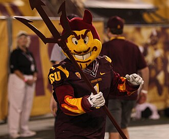

```{r, include=FALSE}
knitr::opts_chunk$set(
  results='asis', 
  echo = FALSE
)
library(tidyverse)
library(glue)

# Set this to true to have links turned into footnotes at the end of the document
PDF_EXPORT <- TRUE

# Holds all the links that were inserted for placement at the end
links <- c()

source('parsing_functions.R')


# First let's get the data, filtering to only the items tagged as
# Resume items
position_data <- read_csv('positions.csv') %>% 
  filter(in_resume) %>% 
  mutate(
    # Build some custom sections by collapsing others
    section = case_when(
      section %in% c('research_positions', 'industry_positions', 'sporting_positions') ~ 'positions', 
      section %in% c('data_science_writings', 'by_me_press') ~ 'writings',
      TRUE ~ section
    )
  ) 

```


Aside
================================================================================


{width=100%}

Contact {#contact}
--------------------------------------------------------------------------------


- <i class="fa fa-envelope"></i> atreya-the-sundevil-@asu.edu
- <i class="fa fa-twitter"></i> AtreyaTheSunDevil
- <i class="fa fa-github"></i> https://github.com/ashish6149/atreya-cv
- <i class="fa fa-link"></i> [https://watts-college.github.io/atreya-cv](https://watts-college.github.io/atreya-cv)
- <i class="fa fa-phone"></i> (423) 555-2355


Language Skills {#skills}
--------------------------------------------------------------------------------


```{r}
skills <- tribble(
  ~skill,               ~level,
  "R",                  5,
  "Javascript (d3.js)", 2,
  "Python",             4,
  "Bash",               1.5,
  "SQL",                5,
  "C++",                2,
  "AWK",                3
)
build_skill_bars(skills)
```


Open Source Contributions {#open-source}
--------------------------------------------------------------------------------

All projects available at `github.com/ashish6149`


- `montyhall`: R package to solve the MontyHall problem


More info {#more-info}
--------------------------------------------------------------------------------

See full CV at https://watts-college.github.io/atreya-cv/cv.html for more complete list of positions and publications.


Disclaimer {#disclaimer}
--------------------------------------------------------------------------------

Made w/ [**pagedown**](https://github.com/rstudio/pagedown). 

Source code: [https://watts-college.github.io/atreya-cv](https://github.com/ashish6149/atreya-cv).

Last updated on `r Sys.Date()`.


Main
================================================================================

Sparky The SunDevil {#title}
--------------------------------------------------------------------------------

```{r}
intro_text <- "I have served as the greatest mascot in the history of Arizona State University football team for 3 years. I completed my undergraduate studies in Paintbrush Management and I am currently a PhD candidate in Mascoting.

Currently searching for a data science position that allows me to integrate my mascotting skills to analytical skills to research and help the furter generations of SunDevil mascots to become successful. 
"


cat(sanitize_links(intro_text))
```


Education {data-icon=graduation-cap data-concise=true}
--------------------------------------------------------------------------------

```{r}
position_data %>% print_section('education')
```


Selected Positions {data-icon=suitcase}
--------------------------------------------------------------------------------

```{r}
position_data %>% print_section('positions')
```

Selected Writing {data-icon=newspaper}
--------------------------------------------------------------------------------


```{r}
position_data %>% print_section('writings')
```


